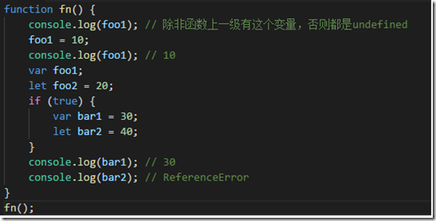
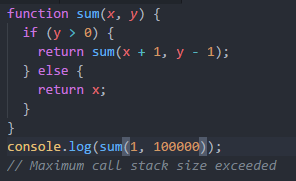
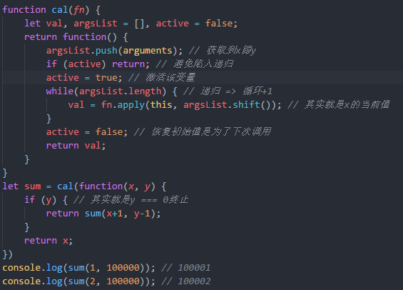
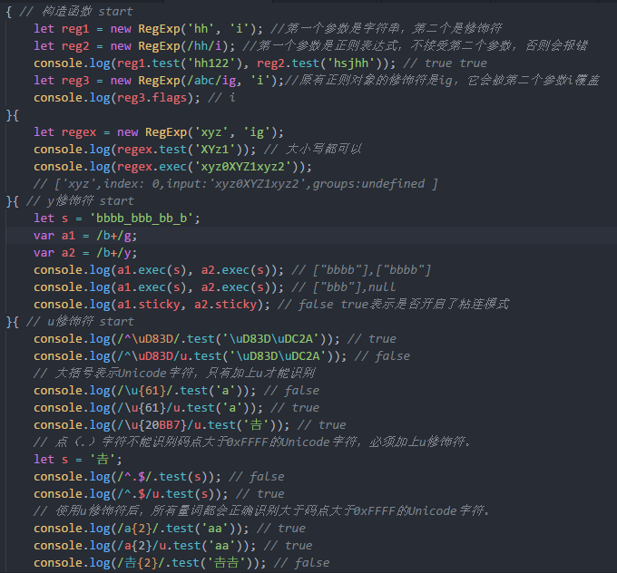

# ES学习小结

​		自从开始从事前端工作后,深感对技术栈欠缺明确的认知，很多东西似是而非，一知半解。在经过跟同样从事前端行业的朋友交流一番后，痛定思痛，决心从根本开始学起，本次学习将沿着以下的思维导图进行更为深入的基础开始，期望可以解答之前尚存的疑虑。

## 	1 变量声明

​		ES5中，使用var关键词进行变量的声明，存在声明的变量或函数都将提升到函数的最顶部（作用域提升），导致可以在使用变量之后再声明变量，会导致代码编写行为不规范。而ES6新增的let及const的作用域都是当前的代码块，区别在于，let声明的变量可以修改，而const 声明的是常量，不能修改。

补充，var声明变量可以重复声明，而let 、const不允许（function跟var存在相同情况，函数可以提升，且可以重复声明）

作用域详见：https://www.cnblogs.com/hxw1024/p/12074362.html

后续新增：

​      共享内存和原子操作：由全局对象SharedArrayBuffer和Atomics实现，将数据存储在一块共享内存空间中，这些数据可在JS主线程和web-worker线程之间共享(ES2017)

ES提案

​	globalThis对象：作为顶层对象，指向全局环境下的this

​	do表达式：封装块级作用域的操作，返回内部最后执行表达式的值(do{})
​	throw表达式：直接使用throw new Error()，无需()或{}包括
​	!#命令：指定脚本执行器(写在文件首行)

## 	2 解构赋值

​		解构顾名思义按照一定的结构“解析”一个对象，通过这种方式我们可以从数组或对象中取值，本质上属于 **模式匹配**，这是`ES6`给我们提供的新语法，只要等号两边的模式相同即可解析相应的值。

### 	（1）扩展运算符…

​       在使用解构赋值的时候，可以使用扩展运算符`...`来将剩余值统一放入一个对象中，

### 	（2）默认值与默认参数

​		在我们使用解构赋值的时候，可以为不存在的值或值为undefined赋默认值

​		当然了。也可以将默认值换成默认函数（返回一个默认值）：

​		函数形参也可以使用这种写法：

## 3 扩展内容

###     （1）数值扩展

1、从ES6之后，使用前缀0b代表二进制数，使用0o代表八进制数，转换成十进制用Number（）函数，在非严格模式下，0o011===011返回为true,在严格模式下会报错。

2、新增的Number方法：

3、新增的Math方法：

4、左移运算符<< 和 右移运算符 >>

左移运算符<<: 在数字不溢出的情况下，左移n位相当于乘以2的n次方(当然首先要转换成二进制)

右移运算符>>: 与左移相反，高位的空位补符号位，正数补0，负数补1

无符号右移运算符>>>:不考虑是否正负

指数运算符: 2**5相当于2的5次方（相当于Math.pow()）

后续新增

 ES提案

​	数值分隔符( _ )：使用_作为千分位分隔符(增加数值的可读性)
 	BigInt()：创建任何位数的整数(新增的数据类型，使用n结尾)

### （2）字符串扩展

1、Unicode表示法：大括号包含表示Unicode字符(\u{0xXX}或\u{0XXX})

2、字符串遍历：可通过for-of遍历字符串

3、字符串模板：可单行可多行可插入变量的增强版字符串 也就是 ``

4、标签模板：函数参数的特殊调用（也就是${变量}）

5、新增的方法：

后续新增方法：

ES2017:

 	padStart()：把指定字符串填充到字符串头部，返回新字符串
	 padEnd()：把指定字符串填充到字符串尾部，返回新字符串

ES2018:

​	放松对标签模板里字符串转义的限制：遇到不合法的字符串转义返回undefined`并且从`raw上可获取原字符串

ES2019:

​	直接输入U+2028和U+2029：字符串可直接输入行分隔符和段分隔符

 	JSON.stringify()改造：可返回不符合UTF-8标准的字符串

​	trimStart()：消除字符串头部空格，返回新字符串

​	trimEnd()：消除字符串尾部空格，返回新字符串

### （3）对象扩展

1、对象属性的简洁写法

属性名简写

方法名简写：

2、**属性名表达式**

3、**方法的name属性**

4、**属性的可枚举性和遍历**

5、**super关键字**：指向当前对象的原型对象(只能用在对象的简写方法中`method() {}`)

6、新增的方法

7、后续新增方法

ES2017：

​	

ES2018:

  扩展运算符（...）:转换对象为用逗号分隔的参数序列({ ...obj }，相当于rest/spread参数的逆运算)

什么意思呢？我们看下具体的应用场合：

ES2019:

​	Object.fromEntries()：返回以键和值组成的对象(Object.entries()的逆操作)

ES提案

​	链判断操作符(?.)：是否存在对象属性(不存在返回undefined且不再往下执行)
 	空判断操作符(??)：是否值为undefined或null，是则使用默认值

### （4）数组扩展

新增的数组方法：

具体的应用场景：

补充说明

​     使用keys()、values()、entries()返回的遍历器对象，可用for-of自动遍历或next()手动遍历

后续新增方法：

ES2016:

 	includes()：是否存在指定成员

ES2019:

 	flat()：扁平化数组，返回新数组(相当于还是递归实现这一功能的)
	 flatMap()：映射且扁平化数组，返回新数组(只能展开一层数组)

### （5）函数扩展

主要是多了这些方法

其中，尾调用的进阶用法尾递归值得我们重视，我们知道递归调用是非常消耗内存的，动辄需要同时保存成百上千的调用帧，容易造成“栈溢出”，但对于尾递归来说，由于只存在一个调用帧，所以永远不会发生“栈溢出”错误。

尾递归优化方案：

补充说明：

 		ES6 的尾调用优化只在严格模式下开启，正常模式是无效的。

除此之外，还有我们常用到的箭头函数：

​		箭头函数的特性：
​			1.没有自身的this
​			2.不能使用new
​			3.没有arguments（参数列表）

==========================================================

1、没有自身的this
	  我们来看普通的函数(返回的函数相当于fn1函数内的嵌套函数)：

  	如果是箭头函数的this执行会是怎样的呢？

call方法的使用详见：https://www.cnblogs.com/hxw1024/p/12077636.html

2、不能使用new

3、没有arguments
首先，什么是arguments呢？

我们给min函数提供了实参，但是min函数本身是没有形参的，那它输出的结果是这样子的：

返回的是名为arguments的列表，这就是我们函数调用时的参数列表，普通函数可以打印，那换成箭头函数呢？

当然，如果你想更了解arguments，可以参见：https://www.jianshu.com/p/d7ed5ade67a3
另外附上arguments的实践应用：
制定一个求出最大值的函数：

补充说明：

1、箭头函数不可使用yield命令，因此箭头函数不能用作Generator函数
2、箭头函数返回对象时必须在对象外面加上括号

后续新增：

**函数参数尾逗号**：允许函数最后一个参数有尾逗号(ES2017)

ES2019

​	toString()改造：返回函数原始代码(与编码一致)

 	catch()参数可省略：catch()中的参数可省略

ES提案

​	函数部分执行：复用函数功能(?表示单个参数占位符，...表示多个参数占位符)
 	管道操作符(|>)：把左边表达式的值传入右边的函数进行求值(f(x) => x |> f)
​	 绑定运算符(::)：函数绑定(左边是对象右边是函数，取代bind、apply、call调用)

​	bind：bar.bind(foo) => foo::bar
​	apply：bar.apply(foo, arguments) => foo::bar(...arguments)

### （6）正则扩展

ES2018:

1、Lookbehinds断言

2、具名组匹配（捕获分组命名）

这是什么东西呢？假设我们想要在获取的字符串中获取图片文件的文件名，我们可以这样做：

​	但是问题来了，如果需要在返回时间的字符串中，不仅获取完整的时间，还想要获取具体的年、月、日，之前大部分会采取这样的做法：

 	   这样就产生了一个问题：在更为复杂的模式下，使用数字引用组可能会导致获取具体内容的混乱，也就是说会弄不清究竟哪个组才是我们想要获取的内容，于是，ES2018使用了更具表现力的 `(?<name>...)` 形式的语法：

3、s修饰符（使`.`匹配任意单个字符(`dotAll模式`)

4、Unicode转义

## 4 数据结构与数据类型

### （1）Set

什么是set? ES6新增的数据结构，类似于数组，但它的一大特性就是所有元素都是唯一的，没有重复。

很显然，它可以做到数组元素的去重：

方法：

属性：

应用场景:

1、字符串去重

2、数组去重

3、集合数组

4、映射集合

注意事项：

1、遍历顺序：插入顺序

2、没有键只有值，可认为键和值两值相等

3、添加多个`NaN`时，只会存在一个`NaN`

4、添加相同的对象时，会认为是不同的对象

5、添加值时不会发生类型转换(`5 !== "5"`)

`6、keys()`和`values()`的行为完全一致，`entries()`返回的遍历器同时包括键和值且两值相等

====================================

补充说明：WeakSet

什么是WeakSet？ 和Set结构类似，成员值只能是对象

应用场景

- 储存DOM节点：DOM节点被移除时自动释放此成员，不用担心这些节点从文档移除时会引发内存泄漏
- 临时存放一组对象或存放跟对象绑定的信息：只要这些对象在外部消失，它在`WeakSet结构`中的引用就会自动销毁

注意事项

- 成员都是`弱引用`，垃圾回收机制不考虑`WeakSet结构`对此成员的引用
- 成员不适合引用，它会随时消失，因此ES6规定`WeakSet结构不可遍历`
- 其他对象不再引用成员时，垃圾回收机制会自动回收此成员所占用的内存，不考虑此成员是否还存在于`WeakSet结构`中

### （2）symbol

我们知道ES5中的基本数据类型有undefined、null、boolean、number、string，引用类型有object（包含`Array`、`Function`、`Date`、`RegExp`、`Error`）；在ES6中新增了一个基本数据类型：symbol。

那什么是symbol？类似于一种标识唯一性的ID，独一无二。

方法：

内置方法：

应用场景：

1、唯一化对象属性名：属性名属于Symbol类型，就都是独一无二的，可保证不会与其他属性名产生冲突

 可以利用这一特性，对不同常量进行区分（无需为常量进行赋唯一值，本身symbol类型就保证了唯一性）

2、消除魔术字符串：在代码中多次出现且与代码形成强耦合的某一个具体的字符串或数值

3、遍历属性名：无法通过`for-in`、`for-of`、`Object.keys()`、`Object.getOwnPropertyNames()`、`JSON.stringify()`返回，只能通过Object.getOwnPropertySymbols和Reflect.ownKeys（）返回

4、启用模块的Singleton模式：调用一个类在任何时候返回同一个实例(`window`和`global`)，使用`Symbol.for()`来模拟全局的`Singleton模式`

5、定义类的私有属性/方法

      

6、注册和获取全局的Symbol

 我们知道，Symbol（）创建的都是唯一的，那如果我们想要在创建一个Symbol数值后，再去获取它，怎么做呢？

补充说明：

1、Symbol()`生成一个原始类型的值不是对象，因此`Symbol()`前不能使用`new命令

2、Symbol()`参数表示对当前`Symbol值`的描述，相同参数的`Symbol()`返回值不相等

3、Symbol值不能与其他类型的值进行运算

4、Symbol值`可通过`String()`或`toString()显式转为字符串

5、Symbol值作为对象属性名时，此属性是公开属性，但不是私有属性

6、Symbol值`作为对象属性名时，只能用方括号运算符(`[]`)读取，不能用点运算符(`.)读取

后续新增

ES2019

​	description：返回Symbol值的描述

### （3）Map

什么是Map？类似于对象的数据结构，成员键可以是任何类型的值。

具体化：我们知道原先对象内属性名只能是字符串，而Map属性名可以是字符串，也可以是对象或数组。它是一个更完善的hash结构。

属性：

方法：

补充说明：

1、遍历顺序：插入顺序

2、对同一个键多次赋值，后面的值将覆盖前面的值

3、对同一个对象的引用，被视为一个键

4、对同样值的两个实例，被视为两个键

5、键跟内存地址绑定，只要内存地址不一样就视为两个键

6、添加多个以`NaN`作为键时，只会存在一个以`NaN`作为键的值

`7、Object结构`提供`字符串—值`的对应，`Map结构`提供`值—值`的对应

================================================

WeakMap

什么是WeakMap ？ 和Map结构类似，成员键只能是对象。

属性：**constructor**：构造函数，返回WeakMap

方法：

应用场景：

​     1、储存DOM节点：DOM节点被移除时自动释放此成员键，不用担心这些节点从文档移除时会引发内存泄漏

​     2、部署私有属性：内部属性是实例的弱引用，删除实例时它们也随之消失，不会造成内存泄漏

补充说明：

1、成员键都是`弱引用`，垃圾回收机制不考虑`WeakMap结构`对此成员键的引用

2、成员键不适合引用，它会随时消失，因此ES6规定`WeakMap结构不可遍历`

3、其他对象不再引用成员键时，垃圾回收机制会自动回收此成员所占用的内存，不考虑此成员是否还存在于`WeakMap结构`中

4、一旦不再需要，成员会自动消失，不用手动删除引用

5、弱引用的`只是键而不是值`，值依然是正常引用

6、即使在外部消除了成员键的引用，内部的成员值依然存在

## 5 Promise

promise的起源

 		 在之前，我们处理异步网络请求的时候，往往会采用这样的写法：

​		再复杂一点，我们需要在请求完第一个api后，再去请求第二个接口，那么就变成这样了：

  	基于此，在需求增加的情况下，我们很可能会面临一场灾难性的到来--回调地狱。

造成的后果是：

1、代码庞杂臃肿，可读性极差

2、耦合度过高，难以进行后期的维护

3、代码复用性差，变相让代码更加臃肿

4、容易滋生bug，而且需要在回调里处理异常

这时候，怎么解决这种问题呢？我们希望可以以一种更加友好的方式进行代码的编写，promise规范由此便诞生了。

那什么是promise呢？

promise是异步编程的一种解决方案。目前业内实现解决回调的地狱的有Q和bluebird。

它的定义是：一个可以一起执行多个任务，函数调用后不会立即返回执行的结果的异步操作。

方法：

具体化：比如以下这个例子，p1将数值转换成promise对象，而Promise.all()方法则等待全部实例变更后，再将所有的结果遍历返回。

那如果中途报错呢，还能继续执行遍历返回结果吗？

还差一个Promise.race()未曾提及，那这个方法是该怎么使用呢？

这个作用如其名，所有实例哪个先运行完，返回该实例的值后，不再执行尚未执行完的实例。

实际应用场景：

补充说明;

1、只有异步操作的结果可决定当前状态是哪一种，其他操作都无法改变这个状态
2、状态改变只有两种可能：从pending变为resolved、从pending变为rejected
3、一旦新建Promise对象就会立即执行，无法中途取消
4、不设置回调函数，内部抛错不会反应到外部
5、当处于pending时，无法得知目前进展到哪一个阶段
6、实例状态变为resolved或rejected时，会触发then()绑定的回调函数
7、resolve()和reject()的执行总是晚于本轮循环的同步任务
8、then()返回新实例，其后可再调用另一个then()
9、then()运行中抛出错误会被catch()捕获
10、reject()的作用等同于抛出错误
11、实例状态已变成resolved时，再抛出错误是无效的，不会被捕获，等于没有抛出
12、实例状态的错误具有冒泡性质，会一直向后传递直到被捕获为止，错误总是会被下一个catch()捕获
13、不要在then()里定义rejected状态的回调函数(不使用其第二参数)
14、建议使用catch()捕获错误，不要使用then()第二个参数捕获
15、没有使用catch()捕获错误，实例抛错不会传递到外层代码，即不会有任何反应
16、作为参数的实例定义了catch()，一旦被rejected并不会触发Promise.all()的catch()
17、Promise.reject()的参数会原封不动地作为rejected的理由，变成后续方法的参数

后续新增：

ES2018:

​	finally():指定不管最后状态如何都会执行的回调函数

## 6 Proxy与Reflect

### （1）proxy

定义：修改某些操作的默认行为。

具体化：可以理解成在目标对象之前设置一层拦截，外界对该对象的访问，都必须先通过这层拦截，因此提供了一种机制，可以对外界的访问进行过滤和改写。

还是不明白？那就举个具体的场景：我们想要购买海外的商品，那可能需要找代购，代购到国外买到商品后，回国后再转交给你。在这个场景中，代购起到了中介代理购买的作用，也就是proxy构造函数起到的作用。

参数形式：

方法：

实践方法：

应用场景：(表单验证)

https://segmentfault.com/a/1190000019198822

https://www.cnblogs.com/kdcg/p/9145385.html

后续新增

ES提案

 Promise.try()：不想区分是否同步异步函数，包装函数为实例，使用then()指定下一步流程，使用catch()捕获错误

### （2）Reflect

​		这就不得不提到proxy了，上文我们提到proxy可以修改操作的默认行为，那获取默认行为的工作就交给了reflect。Reflect`对象的方法与`Proxy`对象的方法一一对应，只要是`Proxy`对象的方法，就能在`Reflect`对象上找到对应的方法。这就让`Proxy`对象可以方便地调用对应的`Reflect`方法，完成默认行为，作为修改行为的基础。也就是说，不管`Proxy`怎么修改默认行为，你总可以在`Reflect上获取默认行为。

具体化：Reflect可以修改某些Object方法返回的结果，更为合理（抛出异常 => 返回false）

具体化：将Object操作（命令式）变为函数行为，而且Reflect对象上可以拿到语言内部的方法。

方法:

=============================================================

应用场景

 观察者模式（函数自动观察数据对象，一旦数据有变化，函数就会自动执行）：

## 7 Class

什么是class? 对一类具有共同特征的事物的抽象(构造函数语法糖)。

具体化：类本身指向构造函数，所有方法定义在`prototype`上，可看作构造函数的另一种写法。

怎么解释呢？我们之前如果想要生成一个对象实例的话，我们可以通过构造函数实现：

那它是怎么执行这些代码的呢？

如果用class去实现上文的构造对象实例，我们可以这样做：

如果往class追加方法，我们可以这样做：

那它跟原先的构造函数有什么区别呢？

区别在于：它是不可枚举的。

方法：

属性：

- **__proto__**：`构造函数的继承`(总是指向`父类`)
- **__proto__.__proto__**：子类的原型的原型，即父类的原型(总是指向父类的`__proto__`)
- **prototype.__proto__**：`属性方法的继承`(总是指向父类的`prototype`)

应用场景：

1、私有属性方法	

2、继承混合类

后续新增

ES提案

​	静态属性：使用static定义属性，该属性不会被实例继承，只能通过类来调用
 	私有属性：使用#定义属性，该属性只能在类内部访问
 	私有方法：使用#定义方法，该方法只能在类内部访问
 	装饰器：使用@注释或修改类和类方法

## 8 Module

什么是module？也就是模块，目的就是通过命名空间对各类业务对象进行一定的封装，防止命名冲突。

命令：

**export**：规定模块对外接口

**import**：导入模块内部功能

**复合模式**：变量实质没有被导入当前模块，相当于对外转发接口，导致当前模块无法直接使用其导入变量

加载的实现方式：

模块方案：

- **CommonJS**：用于服务器(动态化依赖) => Node就是运用这个规范
- **AMD**：用于浏览器(动态化依赖)  => RequireJS 在推广过程中对模块定义的规范化产出
- **CMD**：用于浏览器(动态化依赖) =>  SeaJS 在推广过程中对模块定义的规范化产出
- **UMD**：用于浏览器和服务器(动态化依赖)  => AMD和CommonJS的糅合
- **ESM**：用于浏览器和服务器(静态化依赖) => 就是ES6模块

那不同不同模块方案间有什么不同呢？

例如CommonJS与ESM的区别就是：

其它具体可以参考：

https://www.cnblogs.com/chenwenhao/p/12153332.html#_label3

https://www.jianshu.com/p/33d53cce8237

https://blog.csdn.net/sinat_17775997/article/details/84066436

https://www.jianshu.com/p/39c40db654ab

补充说明：

1、ES6模块中，顶层this指向undefined，不应该在顶层代码使用this
2、一个模块就是一个独立的文件，该文件内部的所有变量，外部无法获取
3、export命令输出的接口与其对应的值是动态绑定关系，即通过该接口可获取模块内部实时的值
4、import命令大括号里的变量名必须与被导入模块对外接口的名称相同
5、import命令输入的变量只读(本质是输入接口)，不允许在加载模块的脚本里改写接口
6、import命令命令具有提升效果，会提升到整个模块的头部，首先执行
7、重复执行同一句import语句，只会执行一次
8、export default命令只能使用一次
9、export default命令导出的整体模块，在执行import命令时其后不能跟大括号
10、export default命令本质是输出一个名为default的变量，后面不能跟变量声明语句
11、export default命令本质是将后面的值赋给名为default的变量，可直接将值写在其后
12、export default命令和export {}命令可同时存在，对应复合导入
13、export命令和import命令可出现在模块任何位置，只要处于模块顶层即可，不能处于块级作用域
14、import()加载模块成功后，此模块会作为一个对象，当作then()的参数，可使用对象解构赋值来获取输出接口
15、同时动态加载多个模块时，可使用Promise.all()和import()相结合来实现
16、import()和结合async/await来书写同步操作的代码

后续新增

ES提案

​	import()：动态导入(返回Promise)

​		背景：import命令被JS引擎静态分析，先于模块内的其他语句执行，无法取代require()的动态加载功能，提					案建议引入import()来代替require()
​		位置：可在任何地方使用
​		区别：require()是同步加载，import()是异步加载
​		场景：按需加载、条件加载、模块路径动态化

​	import.meta：返回脚本元信息

## 9 Iterator与Generator

### （1）Iterator

定义：其实就是迭代器，可以为各种不同的数据结构提供统一的访问机制

原理：创建一个指针指向首个成员，按照次序使用next()指向下一个成员，直接到结束位置(数据结构只要部署Iterator接口就可完成遍历操作)

表现的形式：for-of(自动去寻找Iterator接口)

其实我们对这个Iterator并不陌生，在上文中一些场景中，我们已经有好几次用到了：

还有下文中要提到的Generator中的 yield* 表达式，这也是我把它们放在一起讲的原因。

另外的运用场合：

​	for..of、Array.from
​	Map()、Set()、WeakMap()、WeakSet()
​	Promise.all()、Promise.race()

那讲到这，for...of到底是什么，它跟我们之前用来遍历方法又有什么优势呢？

对于没有Iterator接口类数组对象的遍历处理，我们可以用Array.from():

而我们上文所讲的Map及Set中的运用则是如此：

### （2）Generator

定义：就是生成器，封装多个内部状态的异步编程解决方案。

参数形式：

我们发现它的函数内部有一些表达式，比如yield*与yield：

 那yield*有什么应用场景呢？其实我们让它实现数组的扁平化：

还可以给next（）方法进行传参：

实际上，yield 表达式和 next 方法是 generator 函数的双向信息传递。yield 表达式向外传递 value 值，next 方法的参数向内传递值。

补充说明：

1、每次调用next()，指针就从函数头部或上次停下的位置开始执行，直到遇到下一个yield命令或return语句为止
2、函数内部可不用yield命令，但会变成单纯的暂缓执行函数(还是需要next()触发)
3、yield命令是暂停执行的标记，next()是恢复执行的操作
4、yield命令用在另一个表达式中必须放在圆括号里
5、yield命令用作函数参数或放在赋值表达式的右边，可不加圆括号
6、yield命令本身没有返回值，可认为是返回undefined
7、yield命令表达式为惰性求值，等next()执行到此才求值
8、函数调用后生成遍历器对象，此对象的Symbol.iterator是此对象本身
9、在函数运行的不同阶段，通过next()从外部向内部注入不同的值，从而调整函数行为
10、首个next()用来启动遍历器对象，后续才可传递参数
11、想首次调用next()时就能输入值，可在函数外面再包一层
12、一旦next()返回对象的done为true，for-of遍历会中止且不包含该返回对象
13、函数内部部署try-finally且正在执行try，那么return()会导致立刻进入finally，执行完finally以后整个函数才会结束
14、函数内部没有部署try-catch，throw()抛错将被外部try-catch捕获
15、throw()抛错要被内部捕获，前提是必须至少执行过一次next()
16、throw()被捕获以后，会附带执行下一条yield命令
17、函数还未开始执行，这时throw()抛错只可能抛出在函数外部

补充资料：

https://www.jianshu.com/p/8c85189e7605

## 10 Async

什么是async呢？使异步函数、回调函数在语法上看上去更像同步函数的语法糖。

表现形式:

声明的方法：

我们知道，acync函数会返回一个promise对象，这意味着它可以使用promise的方法

async的语义化特点;

1、语义化强

2、里面的await只能在async函数中使用

3、await后面的语句可以是promise对象、数字、字符串等

4、async函数返回的是一个Promsie对象，可使用then()添加回调函数

5、await语句后的Promise对象变成reject状态时，那么整个async函数会中断，后面的程序不会继续执行

命令：await（等待当前Promise对象状态变更完毕）

补充说明
1、内部return返回值会成为后续then()的出参

2、希望即使前一个异步操作失败也不要中断后面的异步操作

3、多个await命令Promise对象若不存在继发关系，最好让它们同时触发
4、数组使用forEach()执行async/await会失效，可使用for-of和Promise.all()代替

5、可保留运行堆栈，函数上下文随着Async函数的执行而存在，执行完成就消失

应用场景：

1、并发请求

后续新增：

ES2018: 

​	 异步迭代器(for-await-of)：，循环等待每个Promise对象变为resolved状态才进入下一步

ES提案：

​	顶层Await：允许在模块的顶层独立使用await命令(借用await解决模块异步加载的问题)

## 11 Realm(ES提案)

定义：提供`沙箱功能`，允许隔离代码，防止被隔离的代码拿到全局对象

声明：new Realm().global

## 12 结语

由衷感谢本文主要思路来源：https://juejin.im/post/5d9bf530518825427b27639d#heading-47

这是一个网易的大佬精心收集，我也是通过他的思路去学习，最后才得到这份总结。另外，遇到一些不理解的问题，也有通过百度获取更加细致讲解的答主，也很感谢他们。